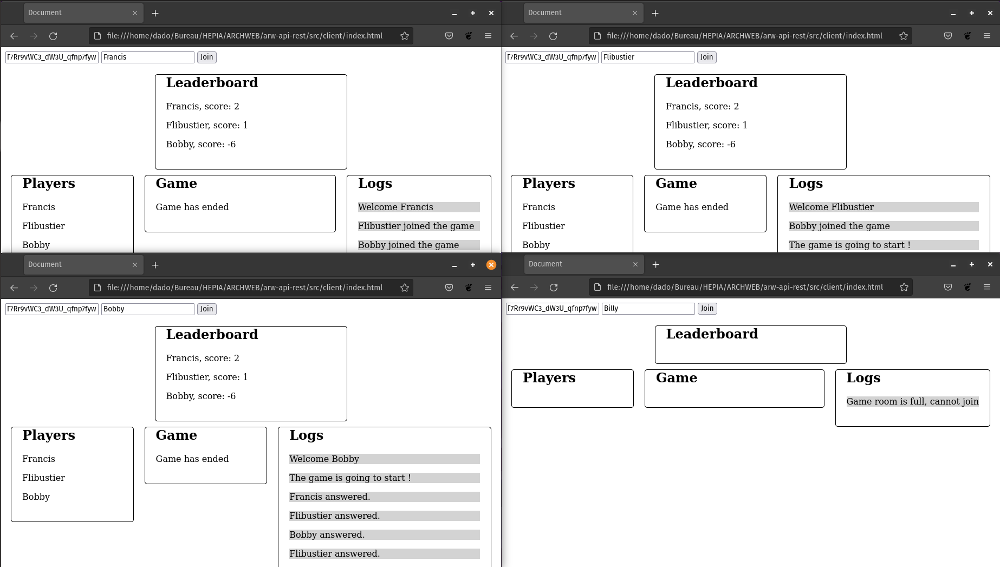

# SIMPLE REST API
**Author**: Damian Boquete Costa
**Last modification**: 11.06.2022

---

### Description
This exercise for the web architecture course puts into practice the creation of a REST API as well as a real-time quiz-style game with socket.io and TypeScript.

### Functioning
The project is divided into two parts: the REST API dedicated to data management and the quiz game.

#### REST API
Regarding the REST API, its functioning is based on multiple HTTP routes. The routes handle various types of interactions with a database.

The schema of the database is described by the following simple diagram: 

<p align="center">
  
</p>

All routes are protected by JWT token verification, ensuring that the payload contains the "administrator" user type. Only the root route "/" and user creation route are accessible to everyone.

The routes are accessible via the following URLs prefixed with http://localhost:30992/ (note that the port number may change depending on what is specified in the `.env` file):

#### Users routes:
```
GET users/
- Lists all users.
```
```
GET users/:id
- Lists a user based on an identifier number.
```
```
POST users/:id
- Allows creating a user. This route adapts based on the role of the user using it. Only an administrator can create another administrator. Other roles can only create "player" accounts.
```
```
PUT users/:id
- Allows modifying a user. The route dynamically adapts the data update based on the received information. It should be noted that an admin cannot change their own user type.
```
```
DELETE users/:id
- Allows deleting a user, ensuring that the user accessing the route does not delete themselves.
```

#### Questions routes:
```
GET questions/
- Lists all questions.
```
```
GET questions/:id
- Lists a question based on an identifier number.
```
```
GET questions/:id/:nb
- Lists a question based on an identifier number and a number of possible answers (nb).
```
```
POST questions/
- Allows creating a question.
```
```
PUT questions/
- Allows modifying a question. The route dynamically adapts the data update based on the received information.
```
```
DELETE questions/
- Allows deleting a question.
```

### Quiz

Regarding the quiz game, the principle is quite simple. The server is launched and waits for 3 players to connect to it. It should be noted that only 3 players can connect at the same time, and other players will be rejected. Here is an example with 4 different clients:

<p align="center">
  
</p>

Here is what the server console indicates:

<p align="center">
  
</p>

We can see an ongoing game and a fourth player whose participation is compromised because the session is already full.

Regarding the game itself, 3 players compete in a series of 10 questions from various categories. Each question is displayed with 3 possible answers, of which only one is correct. The first one to answer will make the question disappear and can earn 1 point if they answered correctly or lose 2 points if their answer is wrong.

Once the 10 questions are completed, the game ends by displaying the scores:

<p align="center">
  
</p>

### Deployment
To deploy this project, you need to start by cloning the project. Then, make sure to run the following command to download all dependencies:
```sh
npm install
```

Once everything is in place, you just need to start the server with the following command:
```sh
npm run start:dev
```

If everything went well, you should be able to access the routes and the game.

Accessing the game is done by "drag & drop" the `src/client/index.html` file into your preferred browser (after starting the server, otherwise you will need to refresh the page).

A Postman collection is available to test the routes.

To test the game, you will need a JWT token. Therefore, you can retrieve one from the `.env` file.

(Note: the `.env` file is exceptionally included in the git because this project is not intended to be put into production. In a real project, it should NEVER be included in the repository).